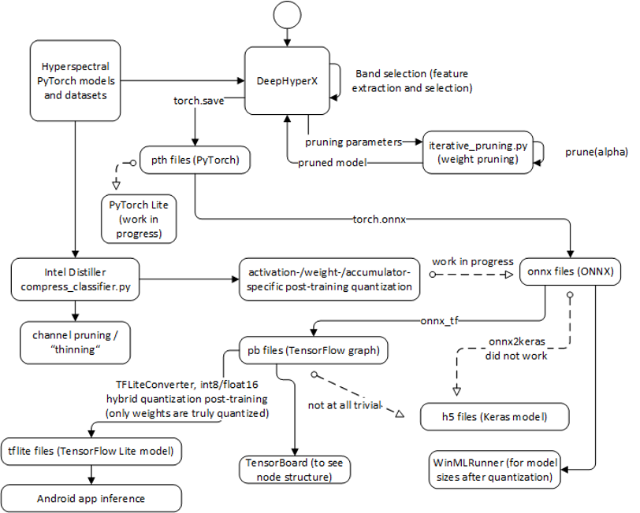

# hsi-toolbox

This is a fork of the [DeepHyperX](https://github.com/nshaud/DeepHyperX) hyperspectral neural network research toolkit, connected to Intel's [Neural Network Distiller](https://github.com/NervanaSystems/distiller) compression toolkit and [iterative_pruning.py](https://github.com/larry0123du/PyTorch-Deep-Compression), all three of which are written in PyTorch.
The goal is to evaluate <b>image and model compression techniques</b> and their respective impact on the accuracy for hyperspectral image classification tasks performed by neural networks for my master thesis "Hyperspectral Image Classification of Satellite Images Using Compressed Neural Networks", where I also touch upon the motivations and theoretical background.

### My Contributions

The following are the main changes and expansions I have made to the existing frameworks:

<b>DeepHyperX:</b>
* added custom datasets <i>Salinas, SalinasA, Cuprite-224, Cuprite-188, Samson, JasperRidge-198, JasperRidge-224, Urban-162, Urban-210, China, USA, Washington</i> and models <i>roy, santara, cao</i> to DeepHyperX:
* integrated band selection methods: <i>PCA, KernelPCA, SparsePCA, IncrementalPCA, LDA, SVD, GRP, SRP, MDS, MiniBatch, LLE, ICA, FactorAnalysis, ISOMAP, t-SNE, UMAP, NMF, FAG, RandomForest, LogisticRegression, LinearRegression, LightGBM, Autoencoder</i>
* time, RAM and VRAM measurements surround key code fragments, e.g., training, inference, band selection
* Excel logging of measured metrics, including 95% CI, means and standard deviations
* added <i>Average Accuracy</i> (AA) metric

<b>Iterative Pruning:</b>
* fine-grained pruning enabled by iterative_pruning.py, which accesses DeepHyperX's models: alpha parameters for threshold-based pruning are arguments of DeepHyperX
 
<b>Intel Distiller:</b>
* base program is connected to DeepHyperX to access hyperspectral models and datasets
* coarse-grained pruning now supports Conv1d and Conv3d layers

### Architecture

The way I have used the frameworks is outlined in the following architecture graph.



As one can see, the main components are DeepHyperX, Intel Distiller and Iterative Pruning. The reason for further conversions lies in PyTorch's difficulty of not physically reducing model sizes after pruning, so to find out the reduced model size, ONNX might be a good detour, followed by converting the model to a TensorFlow format.
At the same time, five-dimensional tensors are rarely supported (in particular, by WinMLTools and Intel Distiller), but we need these for hyperspectral image classification, so it helps to keep in mind that there is a lot of work in progress regarding suitable frameworks.

For visualizations like saliency maps for the cao model in Keras to help explain image classifications, please refer to the project [Cao-Keras-Visualization](https://github.com/daniel-rychlewski/Cao-Keras-Visualization).

### My Results

The results I have obtained from conducting the experiments outlined in my [master thesis](https://github.com/daniel-rychlewski/hsi-toolbox/blob/master/DeepHyperX/outputs/Master%20Thesis.pdf) are the following:
* PCA, NMF, LLE = best band selection methods for high OA
  * 30 of 200 components suffice for PCA/NMF, 90 for LLE → model size savings
  * lots of unsuitable (GRP, SRP, MDS, boulch autoencoder, t-SNE, ISOMAP, UMAP, ...), unreliable (feature selection), inflexible / constrained (LDA, LLE) methods
  * rapid OA growth (feature extraction) vs. linear development (feature selection)
* fine-grained, threshold-based weight and bias pruning:
  * 3 phases, separated by 40-50% and 80-90%: moderate pruning can improve OA or retain it
  * framework-specific challenges for physical size reduction, interoperability, out-of-the-box pruning (much wip)
  * layer-based variation useful for giant layers (luo), where linear layers are less relevant than convolutional layers
  * preferable to coarse-grained l1-based channel pruning wrt OA, but connection holes might be more concerning for efficient computation wrt inference time measurements
* post-training quantization:
  * weights least important, activations less important than accumulators
  * hope to maintain OA, since improvements beyond baseline extremely rare
  * separate component quantization (activations, weights, accumulators) risky, but good combinations exist:
  * (8,16,32) for the best OA, (8,8,32) for a middle ground and (8,4,16) for a budget alternative
  * inference time measurements require supported platform to avoid boxing overhead
* compression pipelines:
  * effects of individual compressions stack, e.g., for the he model, PCA/NMF + <=60% pruning → 99.74 – 100% OA (IndianPines dataset)
    * gradient-based saliency maps confirm unimpaired important neurons for all trainable weights (cf. [Cao-Keras-Visualization](https://github.com/daniel-rychlewski/Cao-Keras-Visualization))
  * more components → shallower decline starting at higher pruning percentage
  * especially for model size considerations, quantization can help
    * can retain much OA in the pipeline with same well-performing bit tripels

For a concise presentation of the results with suitable diagrams, I encourage you to read my [thesis defense](https://github.com/daniel-rychlewski/hsi-toolbox/blob/master/DeepHyperX/outputs/Thesis%20Defense.pptx) (slides in English, notes in German).
The Excel files in `DeepHyperX/outputs/Excel Evaluations` contain both numbers and evaluations in the form of diagrams.
For an in-depth explanation of the results and the underlying theory, please refer to my [master thesis](https://github.com/daniel-rychlewski/hsi-toolbox/blob/master/DeepHyperX/outputs/Master%20Thesis.pdf).

## Getting Started

These instructions will get you a copy of the project up and running on your local machine.

### Prerequisites

Although a command-line execution of all runnable scripts is fully possible, I prefer to use PyCharm with an Anaconda Python 3.6 environment.
Please install the dependencies needed for your Python virtual environment using
```
pip install -r requirements.txt
```
Notwithstanding the packages in the requirements file, please install the CUDA drivers for your GPU so that you can benefit from the faster computation (various tutorials available online). I recommend installing version 10.0 of the cudatoolkit package since I know there are no problems in using that version. 

Python 3.6 is a good choice because the installed dependencies will have the right version and be compatible for sure, while a newer version of dependencies as a consequence of a newer Python version might break the program when training a CNN.

It is required that you download datasets into a Datasets folder under DeepHyperX, whose structure is described here in more detail (the location and name of the folder can be changed if necessary): https://github.com/nshaud/deephyperx#hyperspectral-datasets

The `./DeepHyperX/Datasets/` folder does not exist by default since it would consume a lot of space, but the datasets are available to download on the pages of [EHU](http://www.ehu.eus/ccwintco/index.php?title=Hyperspectral_Remote_Sensing_Scenes) (contains all well-known datasets) and [RS Lab](https://rslab.ut.ac.ir/data). 

Intel Distiller needs Linux as the operating system (already at the stage of parsing command-line arguments), while DeepHyperX runs on Windows.
In case you do not need the power of a GPU, the neural network compression offered by Distiller can be used in, e.g., a Ubuntu-VM.

Please make sure the constants in `DeepHyperX/batch.py` reflect valid paths in your file system and adjust them if necessary. 

### Sample commands

Before every run, make sure to run the visdom visualization server, which can be done by typing in
```
visdom
```
This is convenient because DeepHyperX and, by extension, Intel Distiller (since it accesses its models) generate visualizations (by default, `http://localhost:8097/`) - otherwise, they would continuously try to connect while visdom is not running, which would clutter other outputs.

For demos, tests, licenses, contribution guidelines and further use cases of DeepHyperX, Intel Distiller and iterative_pruning.py, which are irrelevant for this particular hsi-toolbox project, please refer to their respective descriptions. The following are useful commands for my project:

<b>DeepHyperX/main.py</b>: perform image classification run(s) with the desired model and parameters on the dataset specified, e.g.:
```
main.py --model hamida --epoch 3 --dataset IndianPines --runs 4 --training_sample 0.8 --with_exploration --cuda 0 --prune --prune_percent 20 --band_selection PCA --mode unsupervised
main.py --model hu --epoch 1 --training_sample 0.8 --runs 1 --with_exploration --dataset IndianPines --cuda 0 --n_components 70 --band_selection Autoencoder --autoencoder_epochs 10 --mode supervised
main.py --model li --dataset JasperRidge-224 --training_sample 0.7 --cuda 0
```

<b>examples/classifier_compression/compress_classifier.py</b>

Simple run: 
```
compress_classifier.py --arch hamida --dataset IndianPines /home/daniel/Documents/hsi-toolbox/DeepHyperX/Datasets/ -p 30 -j=1 --lr=0.01 --cuda 0
```
Quantization:
```
compress_classifier.py --arch cao --dataset IndianPines --epochs 10 -p 1 --lr=0.001 --cuda 0 ../DeepHyperX/Datasets/ --resume-from "../DeepHyperX/outputs/Experiments/allDatasetsAllModels6Runs/cao17/IndianPines/2019-07-04 02-39-03.357994_epoch100_0.99.pth" --evaluate --quantize-eval --qe-bits-acts 8 --qe-bits-wts 16 --qe-bits-accum 32 --name cao_IndianPines_ptquantize --out-dir ../distiller/outputs/post-training-quantization/ --confusion --vs 0.8
```
Pruning:
```
compress_classifier.py --arch luo_cnn --dataset IndianPines --epochs 1 -p 1 --lr=0.001 --cuda 0 ../DeepHyperX/Datasets/ --greedy --greedy-target-density=0.1 --greedy-ft-epochs 3  --resume-from "D:/OneDrive/Dokumente/GitHub/Experiments/distillerChannelPrune/luo_cnn.pth" --name luo_IndianPines_prune --out-dir .. D:/OneDrive/Dokumente/GitHub/Experiments/distillerChannelPrune/ --confusion --vs 0.8
```
For finding other commands, please refer to the documentation of [DeepHyperX](https://github.com/nshaud/DeepHyperX) and [Intel Distiller](https://github.com/NervanaSystems/distiller) respectively.

## Authors

* [Daniel Rychlewski](https://github.com/daniel-rychlewski) - sole contributor of this project

## Disclaimer

Due to the extreme time pressure and the focus on getting results as fast as possible rather than completeness and applying clean code principles, it is very much possible that one can find numerous code smells and bugs.
Contributions of any kind (e.g., to fix the code style, to ensure the correctness of the implemented additional CNNs in accordance with the papers, to make Distiller work with the "former_technique"+"old_components" flag without cuda etc.) are welcome. This project does not contain authentication details or other sensitive information
I needed to use to run the program on an SSH server, so if you wish to do that, I suggest adding your credentials at appropriate places, e.g., the batch.py file constants (future work might want to outsource these parameters into a config file or program arguments).
